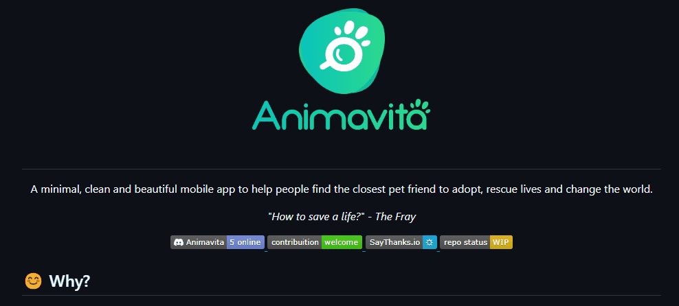

# Projeto com README
Um projeto de teste com um arquivo README 🚀

[]

## Tecnologia utilizadas
- HTML
- CSS

## Como Utilizar

1 - Clone o pro projeto
```
git clone <url>
```

2 - Acesse a pasta do projeto
```
cd aula-tabela
```